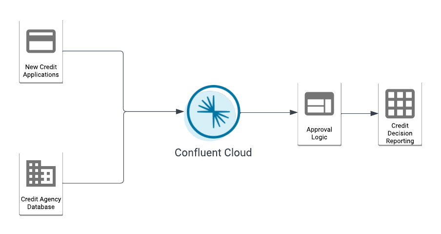

+++
title = "Introduction"
weight = 1
chapter = true
pre = "<b>1. </b>"
+++

## Introduction to Building Data in Motion applications with Confluent on AWS

### Introduction

Making decisions in near-realtime is a challenge many of us are looking to solve.  Confluent offers a number of data connectors and simplified stream processing that can make this less complicated and more reliable.  During this workshop you will learn how to use fully-managed **Confluent Cloud** on **AWS** to source historical data into Apache Kafka, use ksqlDB to process credit applications in real time using the sourced historical data together with generated events.  Once our streaming applications is working we will sink both the approved and not approved events into Amazon Redshift and finally we will visualize this data using Amazon QuickSight.

Below is how the typical use case flow looks like. As new credit applications enter the system, notice how the processing happens, decisions are made in near real time and reporting is offloaded downstream.

And for this workshop how the architecture looks like and AWS Services used along with Confluent Cloud:

