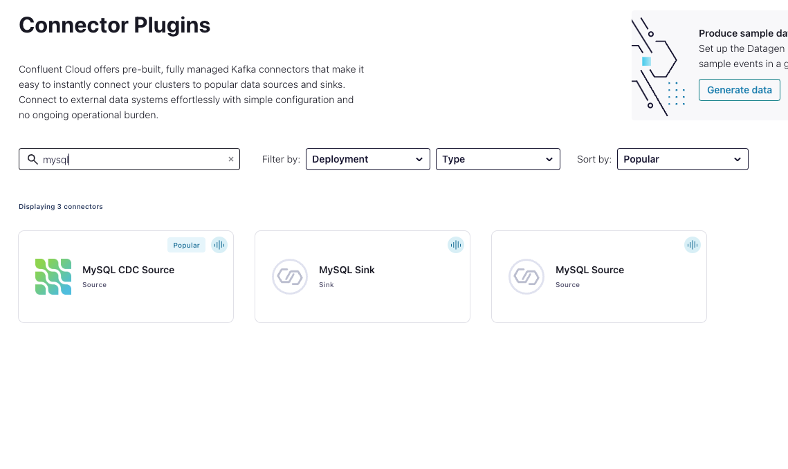
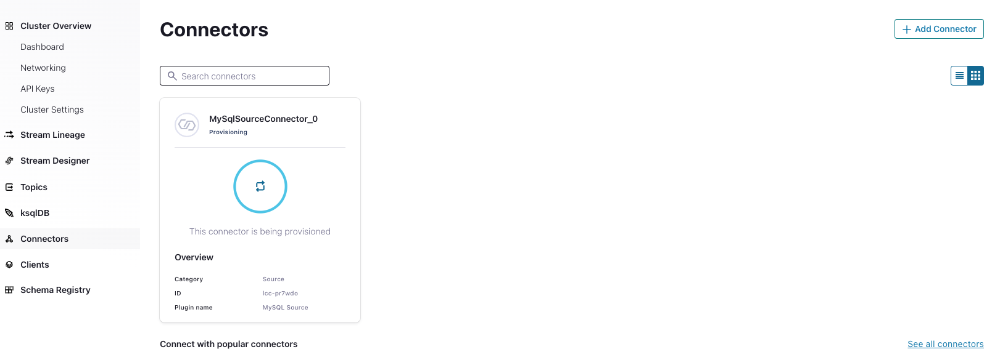

+++
title = "Configuring MySQL Source Connector"
weight = 10
chapter = true
pre = "<b>10. </b>"
+++

## Configuring MySQL Source Connector

While on the Confluent cloud UI and click on **Connector** on the left panel, filter **MySQL** and click on **MySQL source** connector

On the Next page, provide below details: (while entering mysql table names, make sure you press enter after each value is inserted)

| Key                    |  Value                                        |
| ---------------------  | --------------------------------------------- |
| Name                   | LegacyMySqlSource                             |
| Kafka API Key          | *Your Kafka API Key*                          |
| Kafka API Secret       | *Your Kafka API Secret*                       |
| Topic prefix           | mysql_                                        |
| Connection Host        | *MySQL host from AWS CloudFormation output*     |
| Connection port        | 3306                                          |
| Connection user        | admin                                         |
| Connection password    | Password123                                   |
| Database name          | confluentdemo                                 |
| SSL mode               | prefer                                        |
| Table names            | *credit_payment_history*, *credit_utilization*|
| Timestamp column name  | date                                          |
| Table types            | TABLE                                         |
| Database timezone      | America/Los_Angeles                           |
| Output message format  | JSON                                          |
| Tasks                  | 1                                             |

Then Click next. On the next page, review the details provided and click Launch. It would take few minutes for the connector to complete provisioning and start.

You will notice two topics created  **mysql_credit_payment_history** and **mysql_credit_utilization**

Now, lets move to next section.