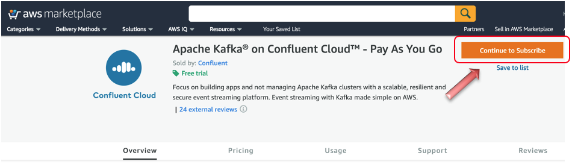
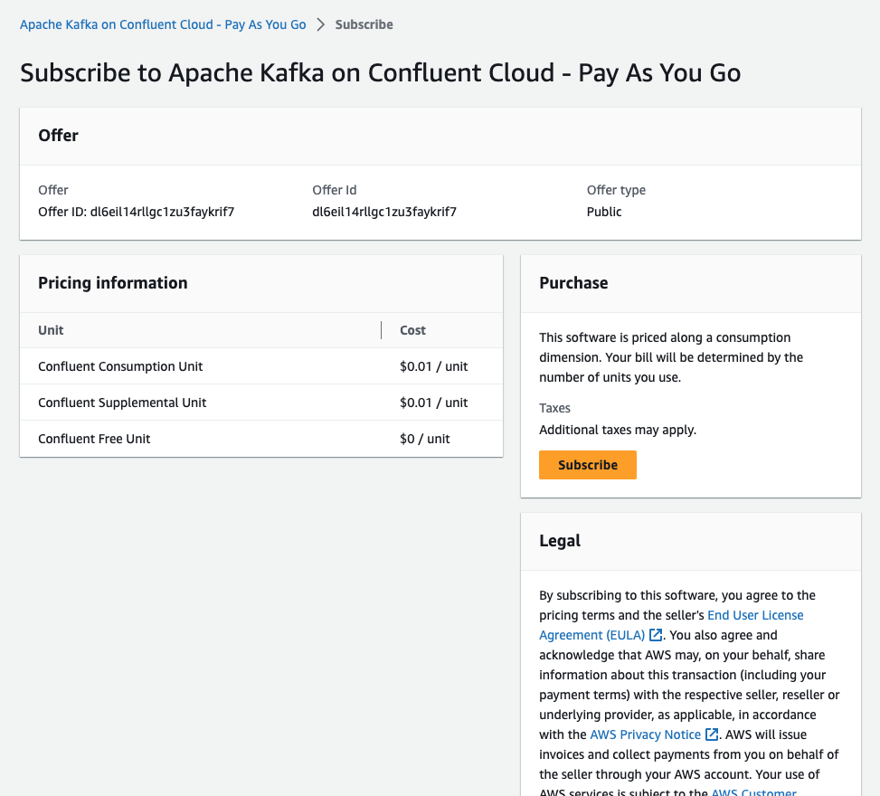
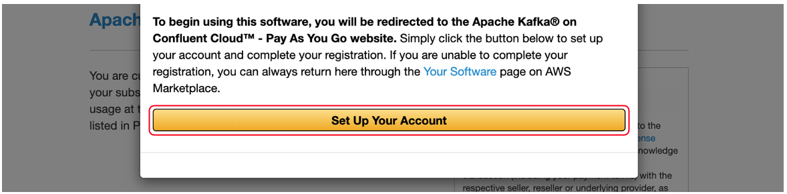
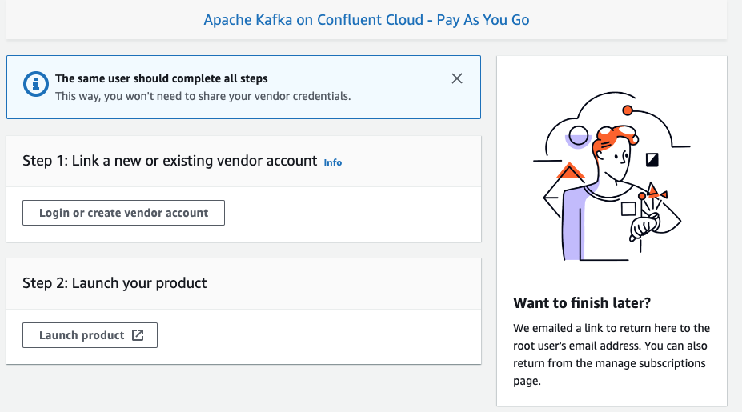

+++
title = "Signing up for Confluent Cloud"
weight = 3
chapter = true
pre = "<b>3. </b>"
+++

## Signing up for Confluent Cloud

If you don’t already have an active Confluent Cloud account, navigate to AWS Marketplace and find [Apache Kafka on Confluent Cloud – Pay As You Go](https://aws.amazon.com/marketplace/pp/B08BVT2QDV?qid=1596552915515). Select the "View Purchase Option" to continue to Subscribe button.

On the next page, review the pricing details and select the Subscribe button.

Next, to create an account, select the Set Up Your Account button on the pop-up window.

You will be redirected to a Confluent Cloud page. Provide the required details and create your account. Once created, you can use this account to carry out the remainder of this procedure.

Note that when you sign up, you get a monthly $400.00 USD credit for the first three months.